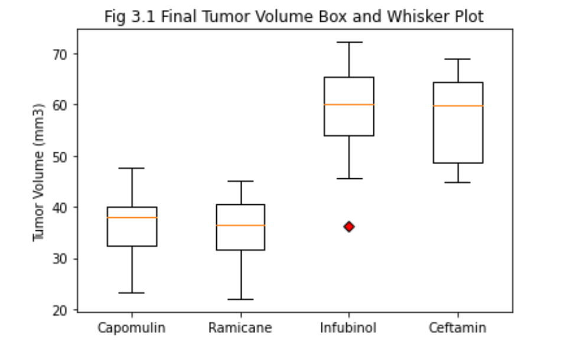
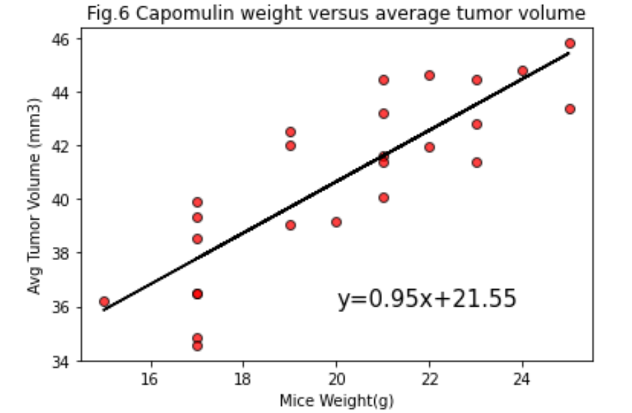

# Pymaceuticals Project

###### This project is to generate a graphical analysis of a Mice Study,where 249 mice identified with SCC tumor growth were treated through a variety of drug regimens. Over the course of 45 days, tumor development was observed and measured. The purpose of this study was to compare the performance of Pymaceuticals' drug of interest, Capomulin, versus the other treatment regimens.
###### The following conclusions summarizes this analysis:

###### * Based on the Summary Statistics Results over the 45 days of the study, it can be seen that Capomulin and Ramicane drug regimens are the most effective and consistent treatments, due that both presents the less tumor volume average (40.68 mm3 and 40.22 mm3 respectively), and thus the standard deviations (0.33 mm3 and 0.32 mm3 respectively). From the standard error (SEM) results, it can be inferred that the Average Tumor Volume for Capomulin Population can be between 40.35 and 41 mm3, and for Ramicane between  39.90 and 40.54 mm3.

###### * From the Bar Plot (Fig.1) it can be seen that all drug regimes begins with almost the same mices number; but at the end of the study most of them has a drastic reduction around the 40% ,unlike "Capomulin" and "Ramicane" which had a drop around the 20%.

###### * Fig 2. (Gender Distribution) shows that gender its not a critical factor for this study, due that there is almost half & half of female and males mices for this analysis. In this case, we cannot define facts or a relationship between the treatments effectiveness and gender.

###### * It is confirmed from Fig. 7, that the best or most promising treatments are:"Capomulin", "Ramicane", "Ceftamin", "Infubinol"(Having only "Capomulin" and "Ramicane" showing an improvement in the tumor size).

###### * From Fig 3.1, and taking in count only the last tumor volume for each mouse, it is confirmed again that "Capomulin" and "Ramicane" are the two most promising treatments between the for best regimens. The Box and Whisker plot, and the quartile's quantitative anlysis demonstrates that the data is very consistent, due that only one possible outlier was found through the data.

###### * From Fig.6, it is observed that there is a strong positive correlation between mice weight and tumor volume, which means that the greater the mice weight(g), the greater the tumor volume(mm3). This can also be confirmed through the lienar model that was generated to this variables analysis, where the line equation obtained was y = 0.74x +- 10.15 (where "y" represents the mice weight and "x" the Tumor Volume).

